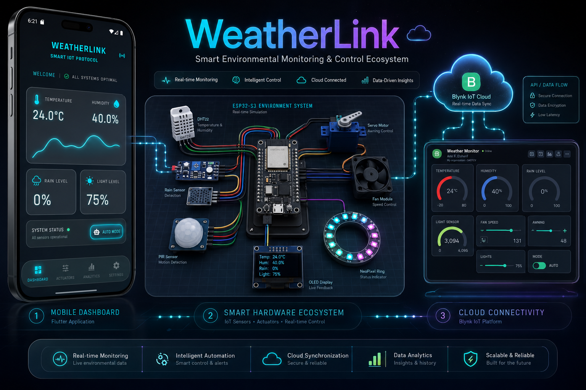

<p align="center"></p>

<h1 align="center">WeatherLink</h1>

<p align="center">
  <strong>End-to-End Smart Environmental Monitoring & Control Ecosystem</strong><br>
  Bridging Embedded C++ (ESP32-S3) with a production-ready Flutter mobile application via the Blynk IoT Cloud.
</p>

<p align="center">
  
  
  
  
  
</p>

---

## Overview

**WeatherLink** is a full-stack IoT solution that creates a seamless feedback loop between the physical environment and the digital user interface. An **ESP32-S3** microcontroller, programmed in **C++** with **PlatformIO**, reads real-time sensor data — temperature, humidity, light, and motion — and drives a set of smart actuators to autonomously respond to environmental conditions.

All sensor telemetry and actuator commands are synchronised through the **Blynk IoT Cloud** using Virtual Pin mapping, which the **Flutter mobile application** consumes via the **Blynk REST API**. The mobile app is architected for production: it implements **Clean Architecture** with a strict separation of Domain, Data, and Presentation layers, and uses **BLoC** for predictable, event-driven state management. The result is a responsive, real-time dashboard that renders at a sustained **60 FPS** under all conditions.

---

## ✨ Core Features

### 📱 Mobile Dashboard (Flutter)

The Flutter application is the primary control interface, built to production standards.

- **Clean Architecture** — Strict separation into `Domain`, `Data`, and `Presentation` layers. The `Domain` layer has zero Flutter dependencies; all business logic is expressed as `UseCases` operating on entities, with failures represented via `dartz` `Either` types.
- **BLoC State Management** — A single `IotBloc` governs the entire application state. Polling the Blynk API, dispatching control commands, and propagating UI state changes are all handled through a typed stream of `Events` → `States`, with no `setState` anywhere in the widget tree.
- **Dependency Injection** — `get_it` is used as the service locator, wiring all layers together at app startup via a centralised `injection_container.dart`.
- **Bento Grid Dashboard** — The main dashboard renders sensor cards in a responsive Bento Grid layout, scaling proportionally with `MediaQuery` and clamping font sizes for readability across all device sizes.
- **CustomPaint Sparklines** — Historical telemetry is rendered using hand-crafted `CustomPaint` sparkline charts, bypassing heavy charting libraries for maximum performance.
- **Neon Glassmorphism UI** — Every surface adheres to a strict neon glassmorphism aesthetic: semi-transparent cards, glowing neon accents, and smooth micro-animations. All colours use **strict hexadecimal ARGB notation** with no raw opacity calls, preventing the grey-blend artefacts common in Flutter glassmorphism implementations.
- **Actuator Detail Screens** — Dedicated master-detail screens for each smart actuator (Awning, Fan, Lights) provide granular telemetry, real-time status, and manual override controls.
- **Auto / Manual Override** — Every actuator supports a two-mode operation model. In **Auto** mode, the firmware's logic dictates behaviour. In **Manual** mode, the app sends a direct command via the Blynk REST API, immediately overriding the autonomous firmware logic.
- **Multi-language Support** — Internationalisation is integrated via `easy_localization`, with translation assets loaded at runtime.

### ⚙️ Hardware Edge (ESP32-S3)

The firmware is the autonomous intelligence layer, operating independently of cloud connectivity.

- **ESP32-S3 (DevKitC-1)** — The primary microcontroller, chosen for its dual-core LX7 architecture, large SRAM, and native USB.
- **Non-blocking C++ Logic** — All sensor polling and actuator control cycles are orchestrated using `millis()`-based timing, ensuring the main loop never blocks and remains responsive to incoming Blynk commands at all times.
- **Smart Actuator Suite:**
  - 🌧️ **Rain-proportional Awning** — A servo-driven awning that extends and retracts based on rain sensor intensity. The deflection angle is computed proportionally to the raw rain sensor reading.
  - 🌡️ **Heat-Index Fan** — A DC fan whose speed is modulated by the computed [Heat Index](https://www.wpc.ncep.noaa.gov/html/heatindex_equation.shtml), derived from DHT sensor temperature and humidity readings.
  - 💡 **LDR + PIR Smart Lights** — NeoPixel lighting controlled by a dual-condition gate: an LDR confirms ambient darkness, and a PIR sensor confirms occupancy. Both conditions must be met for autonomous activation.
- **Sensor Suite:**
  - **DHT22** — Ambient temperature (°C) and relative humidity (%).
  - **Rain Sensor** — Analogue precipitation intensity.
  - **LDR** — Analogue ambient light level.
  - **PIR** — Digital motion detection.
- **Simulation** — The entire hardware schematic is modelled in **Wokwi** (`Simulation/Wokwi_Smart_System/`), enabling full firmware simulation without physical hardware.

### ☁️ Cloud Connectivity (Blynk IoT)

- **Blynk REST API** — The Flutter app communicates exclusively through the Blynk HTTP REST API (`http` package), keeping the cloud layer as a thin, stateless bridge.
- **Virtual Pin Mapping** — All sensor values and actuator states are mapped to Blynk Virtual Pins (`Vx`), providing a clean, schema-like interface between the firmware and the mobile app.
- **Ultra-low Latency Sync** — The `IotBloc` runs a periodic polling loop to pull the latest Virtual Pin states, ensuring the dashboard reflects hardware reality with minimal delay.

---

## 🏗️ Architecture

```
weatherlink/
├── lib/
│   ├── core/
│   │   ├── constants/       # API endpoints, Virtual Pin definitions
│   │   ├── error/           # Failure types (ServerFailure, etc.)
│   │   ├── network/         # HTTP client wrapper
│   │   ├── theme/           # AppTheme, neon glassmorphism tokens
│   │   └── utils/           # Shared utilities
│   ├── features/
│   │   └── iot_control/
│   │       ├── bloc/        # IotBloc, Events, States
│   │       ├── data/        # Repository impl, remote data source
│   │       ├── domain/      # UseCases, entities, repository interface
│   │       └── presentation/
│   │           ├── pages/   # Dashboard, Controls, Settings, Actuator Detail
│   │           └── widgets/ # Reusable UI components, sparklines
│   ├── injection_container.dart
│   └── main.dart
└── Simulation/
    └── Wokwi_Smart_System/  # PlatformIO + Wokwi embedded firmware
        ├── src/main.cpp     # Full C++ firmware source
        ├── platformio.ini   # Board & library configuration
        └── diagram.json     # Wokwi circuit diagram
```

---

## 🛠️ Tech Stack

### Frontend — Mobile Application

| Technology | Role |
|---|---|
| **Flutter** `3.x` | Cross-platform UI framework |
| **Dart** `3.x` | Application language (SDK `^3.11.0`) |
| **flutter_bloc** `^9.1.1` | BLoC state management |
| **get_it** `^9.2.1` | Service locator / dependency injection |
| **dartz** `^0.10.1` | Functional programming, `Either` error handling |
| **http** `^1.6.0` | Blynk REST API client |
| **easy_localization** `^3.0.8` | Internationalisation |
| **google_fonts** `^8.1.0` | Premium typography |
| **equatable** `^2.0.5` | Value equality for BLoC states/events |
| **shared_preferences** `^2.5.5` | Local settings persistence |

### Hardware / Embedded

| Technology | Role |
|---|---|
| **C++** (Arduino framework) | Firmware language |
| **PlatformIO** | Embedded build system & toolchain |
| **ESP32-S3 DevKitC-1** | Target microcontroller (Xtensa LX7 dual-core) |
| **Wokwi** | Hardware simulation environment |
| **DHT22** | Temperature & humidity sensor |
| **ESP32Servo** | Servo motor control (awning) |
| **Adafruit NeoPixel** | Addressable LED control (smart lights) |
| **Adafruit SSD1306** | OLED status display |

### Cloud & Connectivity

| Technology | Role |
|---|---|
| **Blynk IoT** | Cloud broker & Virtual Pin data bus |
| **Blynk REST API** | Mobile-to-cloud HTTP interface |
| **Wi-Fi (ESP32 built-in)** | Firmware-to-cloud transport |

---

## 🚀 Getting Started

### Prerequisites

- [Flutter SDK](https://docs.flutter.dev/get-started/install) `>=3.11.0`
- [PlatformIO Core](https://docs.platformio.org/en/latest/core/installation/index.html) (or the VS Code extension)
- A [Blynk](https://blynk.io/) account with a configured template and device

### 1. Clone the Repository

```bash
git clone https://github.com/dev-amr-elsherif/weatherlink.git
cd weatherlink
```

### 2. Configure Blynk Credentials

Before running either the mobile app or the firmware, add your Blynk credentials. Locate the constants file in `lib/core/constants/` and set your **Auth Token** and **Server URL**.

### 3. Run the Flutter Mobile App

```bash
# Install all Dart/Flutter dependencies
flutter pub get

# Run on a connected device or emulator
flutter run
```

> The app targets **Android** (`com.sherif.weatherlink`) and **iOS** (`com.sherif.weatherlink`). Ensure a simulator or physical device is connected.

### 4. Flash the Embedded Firmware

The hardware firmware lives in `Simulation/Wokwi_Smart_System/` and is managed by **PlatformIO**.

```bash
cd Simulation/Wokwi_Smart_System

# Build and upload to a connected ESP32-S3
pio run --target upload

# Monitor serial output
pio device monitor
```

To run the **Wokwi simulation** instead, open the `Simulation/Wokwi_Smart_System/` folder in VS Code with the Wokwi extension installed and press **`F1` → Wokwi: Start Simulator**.

---

## 📄 License

This project is a private portfolio project. All rights reserved © Amr El-Sherif.
