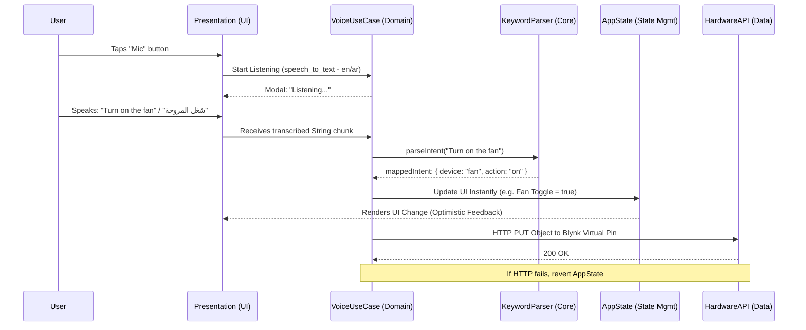

# WeatherLink Technical Architecture & Requirements

## 1. Project Overview
**WeatherLink** is a mobile application acting as a dashboard and control panel for an IoT Smart Home system. It communicates via the Blynk IoT Server with an ESP32-S3 edge node to provide live sensor telemetry and manual actuation of smart home devices, including a voice-control interface.

## 2. Core Tech Stack
*   **Framework:** Flutter (Mobile App).
*   **Architecture Pattern:** Clean Architecture (Domain, Data, Presentation layers).
*   **State Management:** TBD (BLoC / GetX / Provider - await user choice).
*   **UI/UX Aesthetic:** Modern, High-tech, Dark Mode, Neon/Cyberpunk accents, Glassmorphism components.

## 3. Backend & Communication
*   **IoT Platform:** Blynk IoT Server.
*   **Protocol:** Standard HTTP REST API.
*   **Integration:** HTTP GET/PUT requests to read/write Blynk Virtual Pins.
*   **Hardware:** ESP32-S3 edge node (receives/sends data to Blynk and actuates hardware).

## 4. Core Features
*   **Real-time Dashboard:** Display live telemetry for Temperature, Humidity, and Rain Status via polling or webhooks from Blynk.
*   **Manual Control Panel:** UI toggles, switches, and sliders mapped to Blynk Virtual Pins to actuate logical hardware (Smart Fan, Smart Curtains, Multi-Stage NeoPixel Lighting).
*   **Voice Control Interface:** In-app voice command processing to perform actions locally mapped to HTTP requests.

---

## 5. Recommended Folder Structure (Clean Architecture)
To ensure separation of concerns, scalability, and testability, the source code (`lib/`) represents the clean architecture pattern.

```text
lib/
 ├── core/                       # Shared utilities, constants, themes, failure models
 │    ├── constants/             # API keys, endpoint URLs, Blynk Virtual Pins
 │    ├── theme/                 # Dark mode, Glassmorphism styles, Neon color palettes
 │    ├── network/               # HTTP client wrappers
 │    └── utils/                 # Voice parsing helpers, input formatters
 │
 ├── features/
 │    ├── dashboard/             # Real-time telemetry display
 │    │    ├── domain/           # Entities (SensorData), Repositories interfaces, UseCases
 │    │    ├── data/             # Models (JSON mapping), Data Sources (Blynk REST Client)
 │    │    └── presentation/     # State Managers, UI Widgets, Pages
 │    │
 │    ├── control_panel/         # Manual toggles and sliders
 │    │    ├── domain/           # UseCases (ToggleDevice, SetBrightness)
 │    │    ├── data/             # Data Sources (Blynk REST Client)
 │    │    └── presentation/     # State Managers, UI (Glassmorphic switches/sliders)
 │    │
 │    └── voice_control/         # Voice to text processing & intent extraction
 │         ├── domain/           # UseCases (ParseCommand, ExecuteIntent)
 │         ├── data/             # Speech provider integrations
 │         └── presentation/     # Voice listening UI overlay/button, State Manager
 │
 ├── injection_container.dart    # Dependency Injection setup (GetIt)
 └── main.dart                   # Application entry point
```

---

## 6. Essential `pubspec.yaml` Dependencies

```yaml
dependencies:
  flutter:
    sdk: flutter

  # --- State Management & Architecture ---
  # Depending on choice: flutter_bloc, get, or provider
  get_it: ^7.6.7              # Dependency injection (Service Locator)
  equatable: ^2.0.5           # Value equality for states and entities (Recommended for BLoC/Provider)

  # --- Networking & API ---
  http: ^1.2.0                # Standard REST calls
  # dio: ^5.4.2               # Alternative: robust HTTP client

  # --- Voice Control ---
  speech_to_text: ^6.6.0      # Core package for capturing voice commands
  permission_handler: ^11.2.0 # Required for requesting Microphone permissions natively

  # --- UI / Aesthetics ---
  glassmorphism: ^3.0.0       # Provide out-of-the-box glassmorphic containers
  blur: ^3.1.0                # Alternative for easy gaussian blur widgets
  google_fonts: ^6.1.0        # Typography for modern/high-tech UI
  lottie: ^3.1.0              # Complex, smooth micro-animations and loaders
  flutter_animate: ^4.5.0     # For quick neon pulsing and fluid transition effects
```

---

## 7. Voice Control Implementation Plan & Flowchart

The Voice Control feature processes speech locally, classifies intents, and invokes the Blynk HTTP APIs.

### Logic Flow Diagram


### Functional Flow Explanation
1. **Permission Check:** On first activation, the app utilizes `permission_handler` to request iOS/Android Mic access.
2. **Audio Capture Phase:** The user taps the Glassmorphic Mic button. A neon-pulsing overlay appears while `speech_to_text` actively transcribes, handling configured locales (Arabic and English).
3. **Local Natural Language Processing (NLP):**
   - Transcribed text chunks are monitored.
   - Core utility (e.g., `KeywordParser`) uses Dictionary matching or Regex logic to spot device trigger words (`fan/مروحة`, `light/إضاءة`) alongside intent verbs (`on/شغل`, `off/إطفي`).
4. **Optimistic State Feedback:** The moment a valid command is parsed, the State Manager updates the UI locally, so the user sees the switch animate immediately.
5. **Execution & Communication:** An asynchronous HTTP REST call transmits the mapped intent to the associated Blynk Virtual Pin.
6. **Graceful Failures:** If the network request errors out, the state manager rolls back the UI control to its true hardware state and prompts a visually styled error message.
